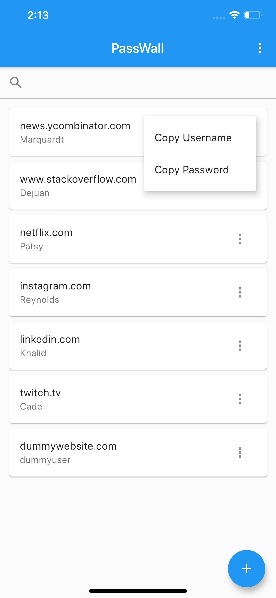

# passwall-mobile

PassWall Mobile is a mobile client for PassWall API written with Flutter.

## Getting Started

[Install](https://flutter.dev/docs/get-started/install) Flutter, clone the repository  and let’s Rock!

Do not forget the  `flutter pub get` 

> For help getting started with Flutter, view their [online documentation](https://flutter.dev/docs), which offers tutorials, samples, guidance on mobile development, and a full API reference.

## Mile Stones

- [x] v0.1.0 Waking Up
	- [x] Authentication
		- [x] Login
		- [x] Check token. If valid, redirect to main screen
		- [x] Logout
	- [x] Get all credentials *(Url or Title, Username and Password)* and list them on the main screen
	- [x] Search in credentials
	- [x] Copy password
- [ ] v0.2.0 Growing Up
	- [x] Pull to refresh in main screen
	- [x] Swipe to delete credential
	- [ ] Update credential
	- [x] Create new credential
	- [ ] Generate password
	- [ ] Order the list
	- [ ] Keeping logs
- [ ] v0.3.0 Trading
	- [ ] Export credential
	- [ ] Import credential
- [ ] v0.4.0 Powering Up
	- [ ] Biometric Auth
	- [ ] Dark Mode
	- [ ] Localization
- [ ] v0.4.0 Polishing
	- [ ] Logo
	- [ ] UI customise  
- [ ] V1.0.0 Compile’n release

## Some Screen Shots
<table>
  <tr>
    <th></th>
    <th></th>
    <th></th>
  </tr>
  <tr>
    <td>Login Screen</td>
    <td>Main Screen</td>
    <td>Copy Actions</td>
  </tr>
</table>

