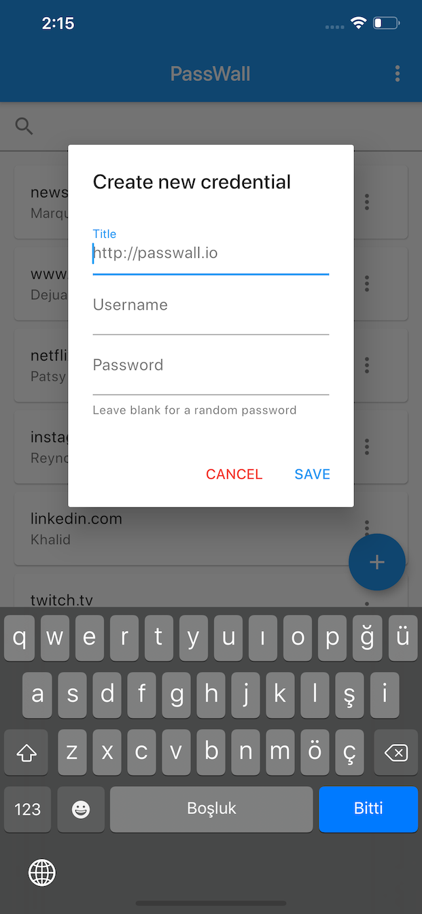

# passwall-mobile

PassWall Mobile is a mobile client for PassWall API written with Flutter.

## Getting Started

1. First, clone the [server app](https://github.com/pass-wall/passwall-server) and buld it.

1. Then, [Install](https://flutter.dev/docs/get-started/install) Flutter, clone the repository  and let’s Rock!

1. Do not forget the  `flutter pub get` 

> For help getting started with Flutter, view their [online documentation](https://flutter.dev/docs), which offers tutorials, samples, guidance on mobile development, and a full API reference.

## Hello Contributers

1. Don't send too much commit at once. It will be easier for us to do a code review.

1. Be sure to take a look at the second branch. The version I am working on is there.

1. First try to fix `//TODO:`s in the code.

1. Then you can contribute to the development by following the mile stones.

1. Don't mess with the user interface. The design guide has not been released yet.

## Mile Stones

- [x] v0.1.0 Waking Up
	- [x] Authentication
		- [x] Login
		- [x] Check token. If valid, redirect to main screen
		- [x] Logout
	- [x] Get all credentials *(Url or Title, Username and Password)* and list them on the main screen
	- [x] Search in credentials
	- [x] Copy password
- [x] v0.2.0 Growing Up
	- [x] Pull to refresh in main screen
	- [x] Swipe to delete credential
	- [x] Update credential
	- [x] Create new credential
	- [x] Generate password
	- [ ] ~~Order the list~~
	- [x] Keeping logs
- [ ] v0.3.0 Trading
	- [ ] Export credential
	- [ ] Import credential
- [ ] v0.4.0 Powering Up
	- [ ] Biometric Auth
	- [ ] iOS Blur Screen when the app is in the background
	- [ ] Dark Mode
	- [ ] Localization
- [ ] v0.4.0 Polishing
	- [ ] Logo
	- [ ] UI customise
		- [ ] Re-design for large screens
- [ ] V1.0.0 Compile’n release

## Some Screen Shots
<table>
  <tr>
    <td></td>
    <td></td>
    <td></td>
  </tr>
  <tr>
    <td>Login Screen:point_up:</td>
    <td>Main Screen:point_up:</td>
    <td>Copy Actions:point_up:</td>
    
  </tr>
  <tr>
    <td></td>
    <td></td>
    <td></td>
  <tr>
    <td>Create Dialog:point_up:</td>
    <td>Detail Screen:point_up:</td>
    <td></td>
  </tr>
</table>

